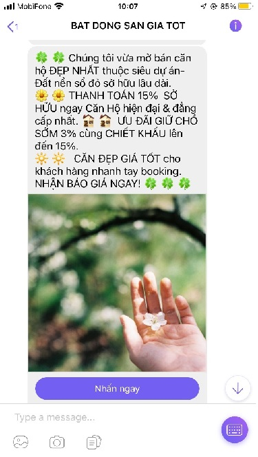

# Hàm gửi tin nhắn Viber dạng GET

<figure><figcaption><p>Tin mẫu Viber</p></figcaption></figure>

* HTTP request\
  URL: [http://rest.esms.vn/MainService.svc/json/SendMultipleMessage\_V4\_get?SmsType={SmsType}\&OTTUrl={OTTUrl}\&OTTImgUrl={OTTImgUrl}\&Phone={Phone}\&Content={Content}\&ApiKey={ApiKey}\&SecretKey={SecretKey}\&Brandname={Brandname}\&OTTLabel={OTTLabel}\&CallbackUrl={CallbackUrl}](http://rest.esms.vn/MainService.svc/json/SendMultipleMessage\_V4\_get?SmsType={SmsType}\&OTTUrl={OTTUrl}\&OTTImgUrl={OTTImgUrl}\&Phone={Phone}\&Content={Content}\&ApiKey={ApiKey}\&SecretKey={SecretKey}\&Brandname={Brandname}\&OTTLabel={OTTLabel}\&CallbackUrl={CallbackUrl})\
  Method: GET

```
curl --location --request GET 'http://rest.esms.vn/MainService.svc/json/SendMultipleMessage_V4_get?SmsType={SmsType}&OTTUrl={OTTUrl}&OTTImgUrl={OTTImgUrl}&Phone={Phone}&Content={Content}&ApiKey={ApiKey}&SecretKey={SecretKey}&Brandname={Brandname}&OTTLabel={OTTLabel}&CallbackUrl={CallbackUrl}' \
--header 'Cookie: ASP.NET_SessionId=hv0fnv0mv4i0qnmx2zrxetvf'
```

*
* Thông tin request

<table><thead><tr><th width="236">Biến</th><th>Định nghĩa</th></tr></thead><tbody><tr><td>SmsType <mark style="color:red;">*</mark></td><td>Loại tin nhắn<br>23: Tin nhắn OTT Viber</td></tr><tr><td>OTTUrl</td><td>Đường dẫn tên nút</td></tr><tr><td>OTTImgUrl</td><td>Đường dẫn hình ảnh</td></tr><tr><td>Phone <mark style="color:red;">*</mark></td><td>Số điện thoại người nhận</td></tr><tr><td>Content <mark style="color:red;">*</mark></td><td>Nội dung gửi đến người nhận</td></tr><tr><td>ApiKey <mark style="color:red;">*</mark></td><td>ApiKey của tài khoản</td></tr><tr><td>SecretKey <mark style="color:red;">*</mark></td><td>Secretkey của tài khoản</td></tr><tr><td>Brandname <mark style="color:red;">*</mark></td><td>Tên Brandname (tên công ty hay tổ chức khi gửi tin sẽ hiển thị trên tin nhắn đó). Chú ý: sẽ phải đăng ký trước khi sử dụng.</td></tr><tr><td>OTTLabel</td><td>Tên nút</td></tr><tr><td>RequestId</td><td>ID Tin nhắn của đối tác, dùng để kiểm tra ID này đã được hệ thống esms tiếp nhận trước đó hay chưa. <br>Ví dụ: RequestId=123456</td></tr><tr><td>CallbackUrl</td><td>eSMS sẽ trả về kết quả của tin nhắn.</td></tr></tbody></table>

* **Lưu ý:** Tin nhắn OTT có thể có các lựa chọn sau:\
  \- OTTUrl – OTTImgUrl – Content – OTTLabel\
  \- Content – OTTLabel – OTTUrl\
  \- OTTImgUrl\
  \- Content
* Kết quả trả về

```
{
    "CodeResult": "100",
    "CountRegenerate": 0,
    "SMSID": "ebe101db-87cd-4285-b97b-6a7a90455ded30"
}
```

* Thông tin kết quả trả về

|       |                                                                                                   |
| ----- | ------------------------------------------------------------------------------------------------- |
| SMSID | ID của tin nhắn mới được tạo ra trên hệ thống eSMS. Dùng ID này để query lấy trạng thái tin nhắn. |
