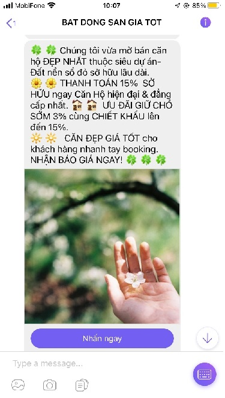

# Hàm gửi tin nhắn Viber dạng POST

<figure><figcaption><p>Tin mẫu Viber</p></figcaption></figure>

* HTTP request\
  URL: [http://rest.esms.vn/MainService.svc/json/SendMultipleMessage\_V4\_post\_json/](http://rest.esms.vn/MainService.svc/json/SendMultipleMessage\_V4\_post\_json/)\
  Method: POST\
  Content Type: application/json


```
curl --location 'https://rest.esms.vn/MainService.svc/json/Send_Multiple_Sms_OTT/' \
--header 'Content-Type: application/json' \
--header 'Cookie: ASP.NET_SessionId=4nga3iwpro5vka3xffydrsgq' \
--data '{
    "ApiKey": "{{ApiKey}}",
    "Brandname": "{{Brandname}}",
    "Content": "{{Content}}",
    "IsSandBox": "0",
    "OttImgUrl": "{{OttImgUrl}}",
    "OttLabel": "{{OttLabel}}",
    "OttUrl": "{{OttUrl}}",
    "Phones": ["{{Phone}}"],
    "SecretKey": "{{SecretKey}}",
    "CallbackUrl":"{{CallbackUrl}}",
    "SmsType": "23"
}'
```


* Thông tin request

<table><thead><tr><th width="236">Biến</th><th>Định nghĩa</th></tr></thead><tbody><tr><td>SmsType <mark style="color:red;">*</mark></td><td>Loại tin nhắn<br>23: Tin nhắn OTT Viber</td></tr><tr><td>OTTUrl</td><td>Đường dẫn tên nút</td></tr><tr><td>OTTImgUrl</td><td>Đường dẫn hình ảnh</td></tr><tr><td>Phones <mark style="color:red;">*</mark></td><td>Số điện thoại người nhận</td></tr><tr><td>Content <mark style="color:red;">*</mark></td><td>Nội dung gửi đến người nhận</td></tr><tr><td>ApiKey <mark style="color:red;">*</mark></td><td>ApiKey của tài khoản</td></tr><tr><td>SecretKey <mark style="color:red;">*</mark></td><td>Secretkey của tài khoản</td></tr><tr><td>Brandname <mark style="color:red;">*</mark></td><td>Tên Brandname (tên công ty hay tổ chức khi gửi tin sẽ hiển thị trên tin nhắn đó). Chú ý: sẽ phải đăng ký trước khi sử dụng.</td></tr><tr><td>OTTLabel</td><td>Tên nút</td></tr><tr><td>CallbackUrl</td><td>eSMS sẽ trả về kết quả của tin nhắn.</td></tr><tr><td>IsSandBox</td><td>Môi trường test thử nghiệm</td></tr></tbody></table>

* **Lưu ý:** Tin nhắn OTT có thể có các lựa chọn sau:\
  \- OTTUrl – OTTImgUrl – Content – OTTLabel\
  \- Content – OTTLabel – OTTUrl\
  \- OTTImgUrl\
  \- Content
* Kết quả trả về

```
{
    "CodeResult": "100",
    "CountRegenerate": 0,
    "SMSID": "f3c18a391c6e4cab832216825048b8f9"
}
```

* Thông tin kết quả trả về

|       |                                                                                                   |
| ----- | ------------------------------------------------------------------------------------------------- |
| SMSID | ID của tin nhắn mới được tạo ra trên hệ thống eSMS. Dùng ID này để query lấy trạng thái tin nhắn. |
