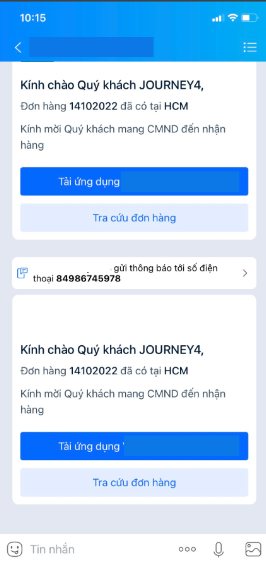

# Hàm gửi tin ZNS JOURNEY

Hàm cho phép bạn gửi tin nhắn đến số điện thoại đã đăng kí Zalo.&#x20;

Để có thể gửi được tin ZNS bạn cần tiến hành:\
\- Đăng ký và xác thực Zalo Offical Account (Zalo OA)\
\- Đăng ký template tin nhắn là template TIN NHẮN HÀNH TRÌNH với ZALO\
Để hoàn thành các việc trên vui lòng liên hệ nhân viên kinh doanh hỗ trợ của bạn hoặc Hotline 0901888484\
VÍ DỤ 1 mẫu tin ZNS JOURNEY

<figure><figcaption></figcaption></figure>

* **HTTP REQUEST**
* URL: [http://rest.esms.vn/MainService.svc/json/SendZaloMessage\_V4\_post\_json/](http://rest.esms.vn/MainService.svc/json/SendZaloMessage\_V4\_post\_json/)
* METHOD: POST
* CONTENT TYPE: application/json  &#x20;

```
curl --location --request POST 'https://rest.esms.vn//MainService.svc/json/SendZaloMessage_V4_post_json/' \
--header 'Content-Type: application/json' \
--header 'Cookie: ASP.NET_SessionId=ppkpsg1cwapbh0daexrtqtxg' \
--data-raw '{
"ApiKey": "{APIKEY}",
"SecretKey": "{SecretKey}",
"Phone": "{09XXXXXXXX}",
"Params": ["{PARAM1}","{PARAM2}","{PARAM3}"],
"IsJourney": true,
"OrderId": "{ORDERID}",
"TempID": "{TempID}",
"OAID": "{OAID}",
"RequestId": "{RequestId}",
"campaignid": "{campaignid}",
"CallbackUrl":"{CallbackUrl}"
}'
```

**THÔNG TIN REQUEST**

| Biến                                         | Định nghĩa                                                                                                                                                                                                                     |
| -------------------------------------------- | ------------------------------------------------------------------------------------------------------------------------------------------------------------------------------------------------------------------------------ |
| ApiKey <mark style="color:red;">\*</mark>    | ApiKey của tài khoản                                                                                                                                                                                                           |
| SecretKey <mark style="color:red;">\*</mark> | Secretkey của tài khoản                                                                                                                                                                                                        |
| Phone <mark style="color:red;">\*</mark>     | Số điện thoại nhận tin                                                                                                                                                                                                         |
| Params <mark style="color:red;">\*</mark>    | <p></p><p>Giá trị cần truyền cho các biến trong Template </p><p>*Lưu ý:</p><ol><li>Các tham số truyền vào phải đúng thứ tự như template bạn đăng ký</li><li>Nếu tham số trùng nhau chỉ cần truyền vào một tham số</li></ol>    |
| IsJourney <mark style="color:red;">\*</mark> | True: Là tính tin nhắn hành trình                                                                                                                                                                                              |
|                                              | Fale: Không phải tin nhắn hành trình                                                                                                                                                                                           |
| OrderId <mark style="color:red;">\*</mark>   | Id của hành trình, dùng để đánh dấu hành trình, bắt buộc có khi gửi tin ZNS Journey                                                                                                                                            |
| TempID <mark style="color:red;">\*</mark>    | Template của Zalo OA mà khách hàng đăng kí với eSMS                                                                                                                                                                            |
|                                              | Đối với loại tin ZNS Journey thì cần phải đăng ký với Zalo mới sử dụng được                                                                                                                                                    |
| OAID <mark style="color:red;">\*</mark>      | <p>Zalo OA ID, là ID của trang Zalo Offical Account của doanh nghiệp. Doanh nghiệp cần đăng nhập vào trang quản trị của Zalo OA để lấy phần Zalo OA ID này. <br><strong>Chú ý: sẽ phải đăng ký trước khi sử dụng.</strong></p> |
| campaignid                                   | <p>ID Tin nhắn của đối tác, dùng để kiểm tra ID này đã được hệ thống esms tiếp nhận trước đó hay chưa. <br>Ví dụ: RequestId=123456</p>                                                                                         |
| RequestId                                    | Tên chiến dịch gửi tin, tối đa 254 ký tự                                                                                                                                                                                       |
| CallbackUrl                                  | eSMS sẽ trả về kết quả của tin nhắn.                                                                                                                                                                                           |

* Kết quả trả về&#x20;

```
{
    "CodeResult": "100",
    "CountRegenerate": 0,
    "SMSID": "ebe101db-87cd-4285-b97b-6a7a90455ded30"
}
```

* Thông tin kết quả trả về

| Trường dữ liệu | Ý nghĩa                                                                                           |
| -------------- | ------------------------------------------------------------------------------------------------- |
| SMSID          | ID của tin nhắn mới được tạo ra trên hệ thống eSMS. Dùng ID này để query lấy trạng thái tin nhắn. |
